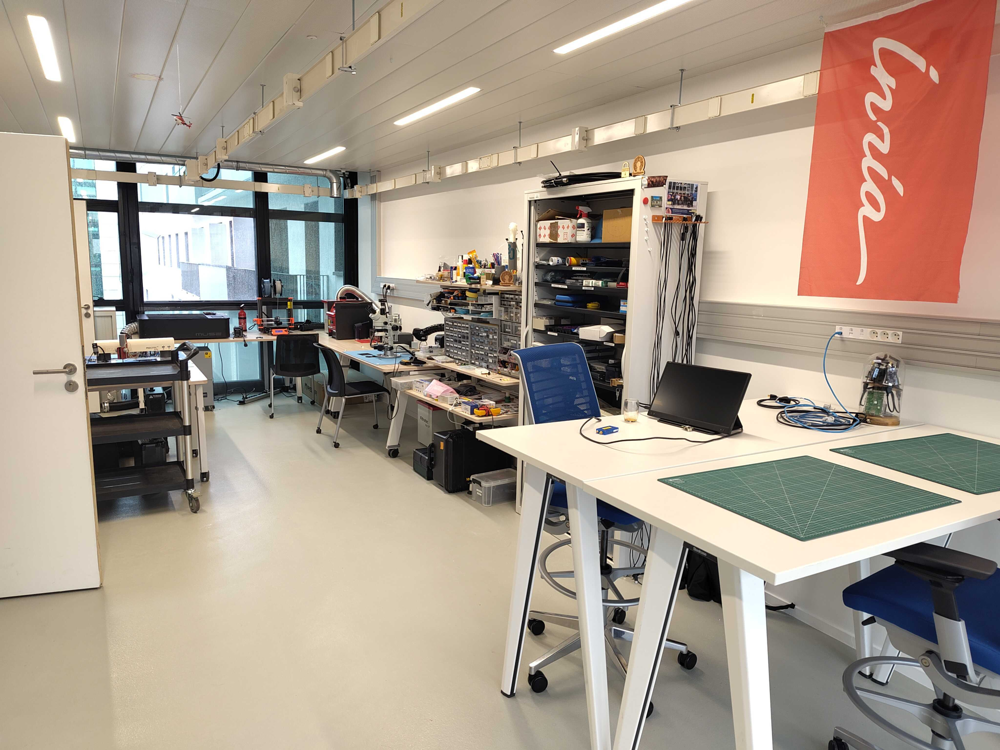
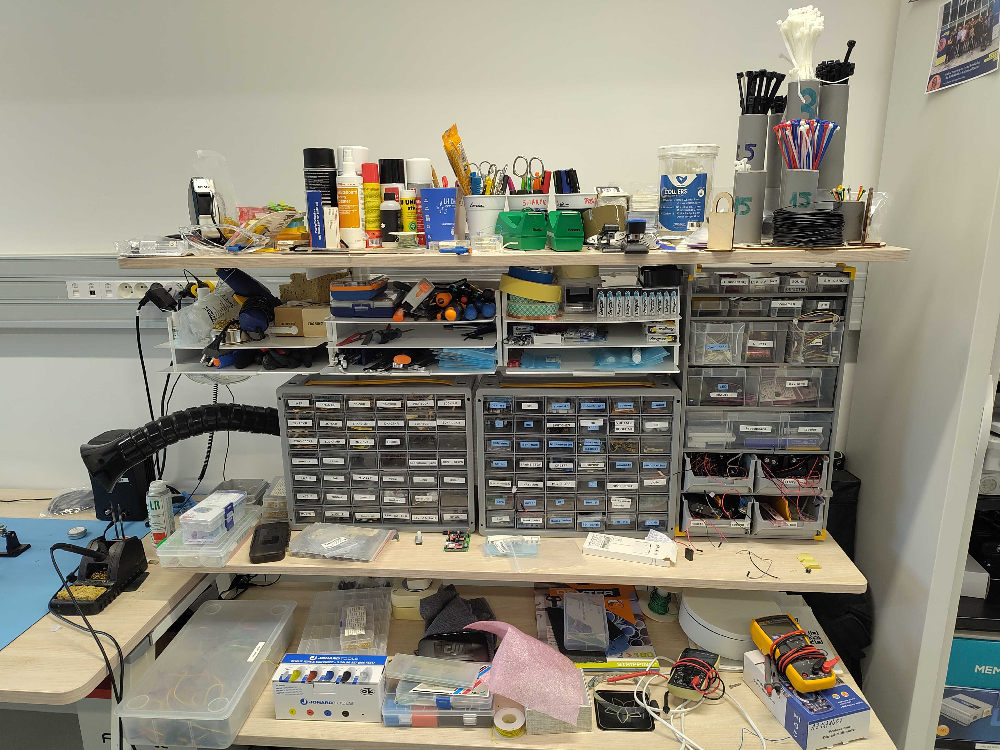

---
hide:
  - navigation
  - toc
---

# Experimentation Room

The experimentation room is a 40m2 space dedicated to prototyping hardware projects,
similar to a mini Fablab.

The room is located within the [AIO team](https://aio.inria.fr/)
laboratory.

     

        
    

    

        
    

## Machines and tools

- [Laser cutter](./muse3d.md)
- [3D printer](./prusamk3.md)
- [Soldering station](./soldering.md)
- [PCB design](./pcb.md)
- [Other tools](./tools.md)

## Projects

See [the projects page](./projects.md)
