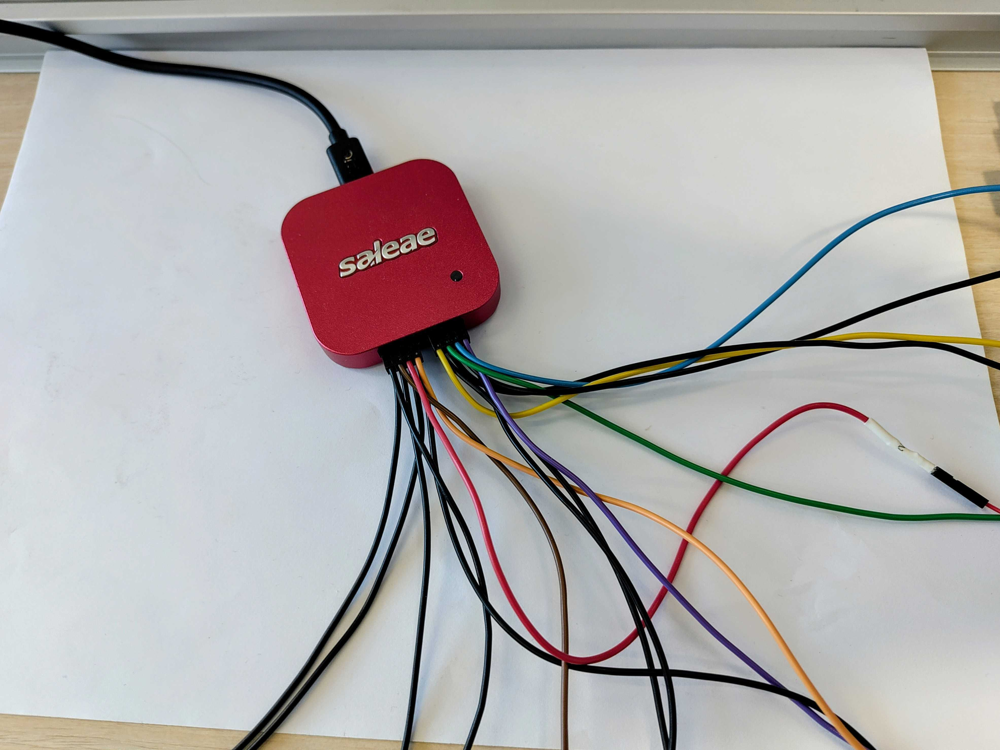
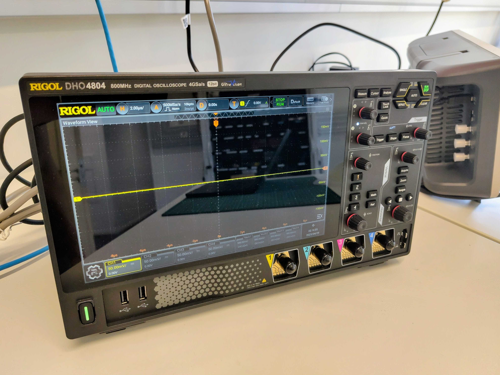
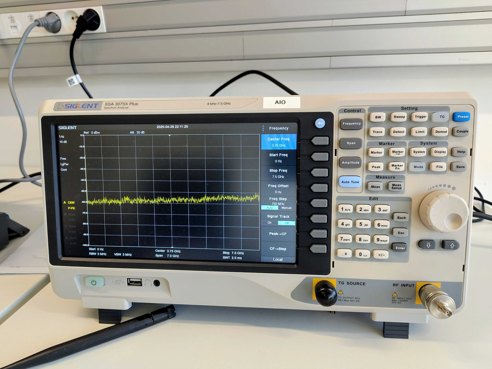

# Measurement Tools

This page describes tools available that can be used for measuring physical quantities :
logical levels, analog signals, radio signals, current, voltage, etc

## Multimeters

The essential tool in electronics.

## Logic Analyzers

Logic analyzers are very useful for debugging signals and timings at hardware level.
The experimentation room provides two [Saleae logic 8](https://www.saleae.com/products/saleae-logic-pro-8) analyzers.

The Saleae software is available for download [here](https://www.saleae.com/pages/downloads).

Please read the [Getting started](https://support.saleae.com/getting-started) before using them.

## Digital Oscilloscope

The experimentation room provides one
[Rigol DHO 4804](https://www.rigolna.com/products/digital-oscilloscopes/dho4000) digital oscilloscope.

## Spectrum Analyzer

The experimentation room provides one
[Siglent SSA3075X-Plus](https://www.siglent.fr/ssa3000x-3000x-plus-serie/60937-267-analyseur-de-spectres-75-ghz-avec-tracking-generator-tg-et-preamplificateur-en-standard.html)
spectrum analyzer.

