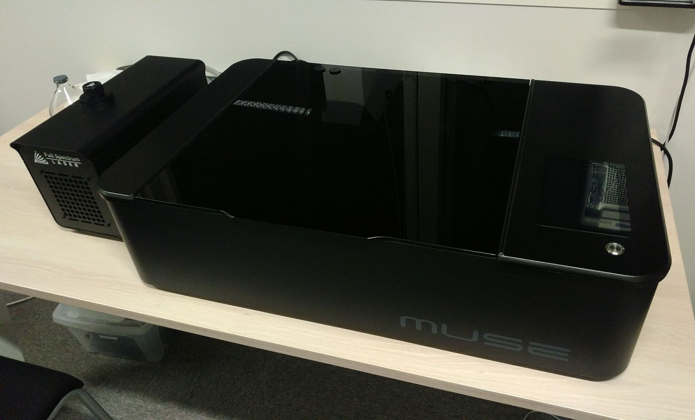

# Laser cutter

The laser cutter is an [FSL Muse 3D](https://fslaser.com/muse3d/).

The Muse 3D manual is available [here](https://2882208.fs1.hubspotusercontent-na1.net/hubfs/2882208/3D%20Manual%204-23.pdf).

Also read the [quick start guide and safety guidelines document](https://2882208.fs1.hubspotusercontent-na1.net/hubfs/2882208/Manuals/Quickstart/FSL_Muse3D_QS_090122.pdf).

The user interface manual is also available online
[here](https://info.fslaser.com/hubfs/Public_Documents/RetinaEngrave%20v3.0%20Manual.pdf).

## Basic usage

Before using the laser cutter, please follow the steps below:

1. Power on the water pump (little black box below the machine) and make sure
   that the water is correctly circulating to the laser cutter

2. Load and configure your project in the RetinaEngrave interface. This has to
   be done by connecting an Ethernet cable between a computer and the laser
   cutter, setup a the 169.254.xx.xx IP address manually in the computer and
   access http://169.254.xx.xx (TODO: update the address).
   **Don't launch the cut now**

3. Start the fume extractor (green button on the big grey box below the machine)

4. Launch the cut

## Other documents

- [Safety tips](https://fslaser.com/blog/five-safety-tips-for-laser-cutters/)

- [Material test](https://fslaser.com/material-test/)

- [RetinaEngrave 3.0 Software](https://fslaser.com/blog/muse-3d-laser-engraver-retinaengrave-v30-software/)

- [Purex fume extractor manual](https://www.cepelec.com/wp-content/uploads/2021/12/Manual-PUR35-822035.pdf)
