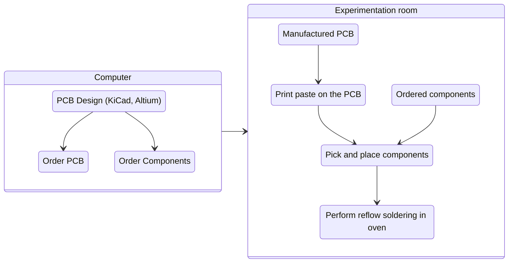
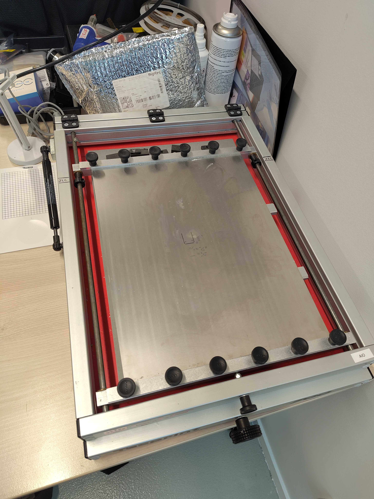
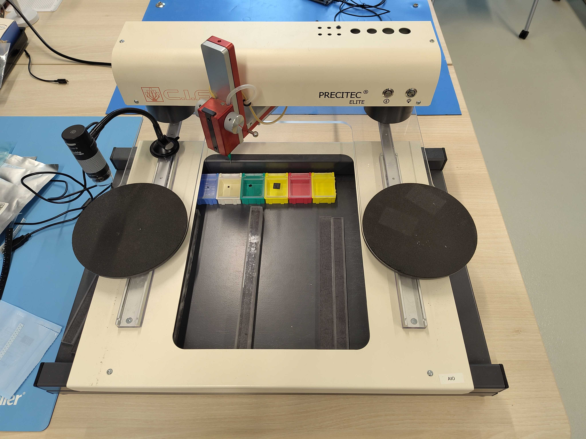
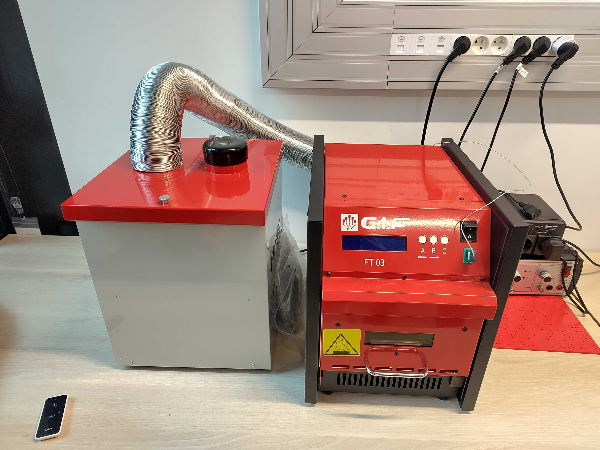

# PCB tools

The experimentation room provides basic tools to assemble electronic components
on a prefabricated PCB.

## Workflow

## Manual solder paste printer

This machine is used to apply soldering paste on the ordered PCB. It is important
to also order a PCB stencil along with the PCB manufacturing.

Once the paste is applied, use the [soldering microscope](soldering.md#soldering-microscope)
to verify it's correctly applied: no missing pads, not too much paste on tiny pads, etc

## Pick and place

The pick and place is used to place all components on the PCB. We recommend to
carefully prepare and sort the components as follows:
- label the components bags with the labels used to name the components on the PCB.
  This saves a lot of time and avoids potential mistakes during the process
- display the board layout on a laptop beside the pick and place

!!! Note

    Unless you have very good eyes it's better to avoid too small components in the
    PCB design, like SMD 0402. Some BGA components with tiny pads might also be
    challenging to assemble with this machine.

Once all components are placed, check again the result with the
[soldering microscope](soldering.md#soldering-microscope). Things to check are correct
placement and orientation of the components

## Reflow oven

This is the last step of the assembly: reflow soldering.

### Usage

1. Place the PCB in the oven

2. Power on the fume extractor using the remote control

3. Power on the oven, press C
