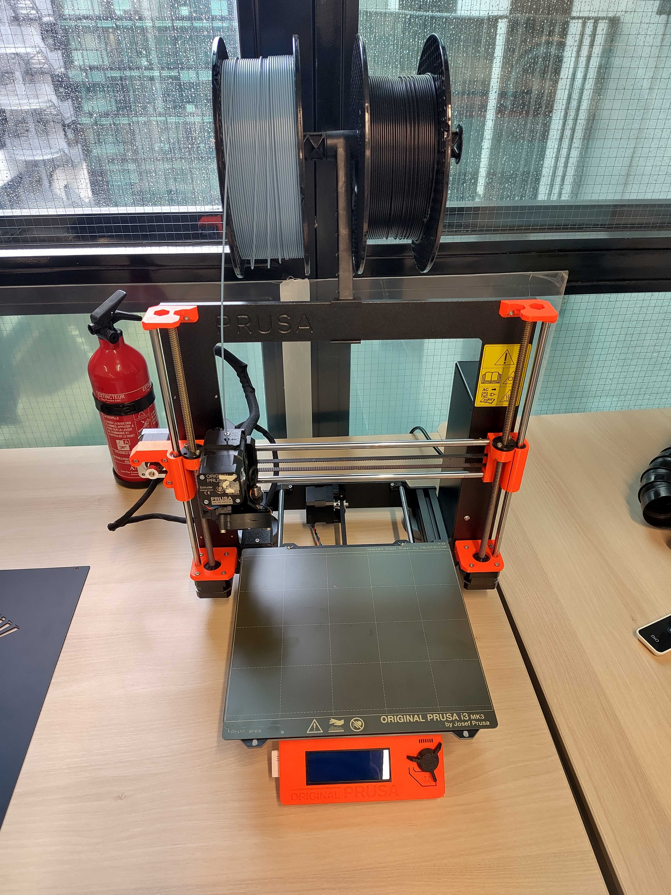

# 3D printer

The 3D printer is a [Prusa i3 MK3S+](https://www.prusa3d.com/category/original-prusa-i3-mk3s/).

## Usage

User manual is available online [here](https://cdn.prusa3d.com/downloads/manual/prusa3d_manual_mk3s_en.pdf).

Use [PrusaSlicer](https://www.prusa3d.com/page/prusaslicer_424/) to export 3D
models (STL, etc) for the 3D printer.

## Material

The 3D printer is usually used with PLA 1.75mm but it has also been used with
success with [FilaFlex 40 from Filatech](https://fila-tech.store/wp-content/uploads/2021/11/FilaFlexible40-Datasheet-1.pdf).

See also
[machine recommended configuration](https://fila-tech.store/wp-content/uploads/2021/11/Recommended-Printer-Configuration.pdf)
for Filatech filaments.
