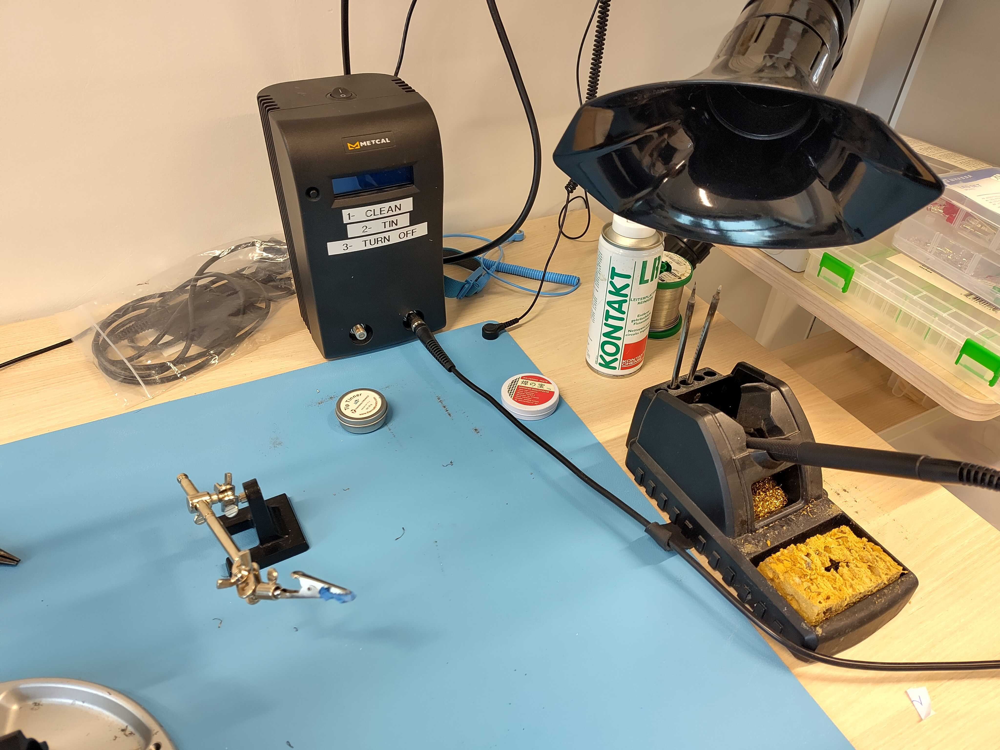
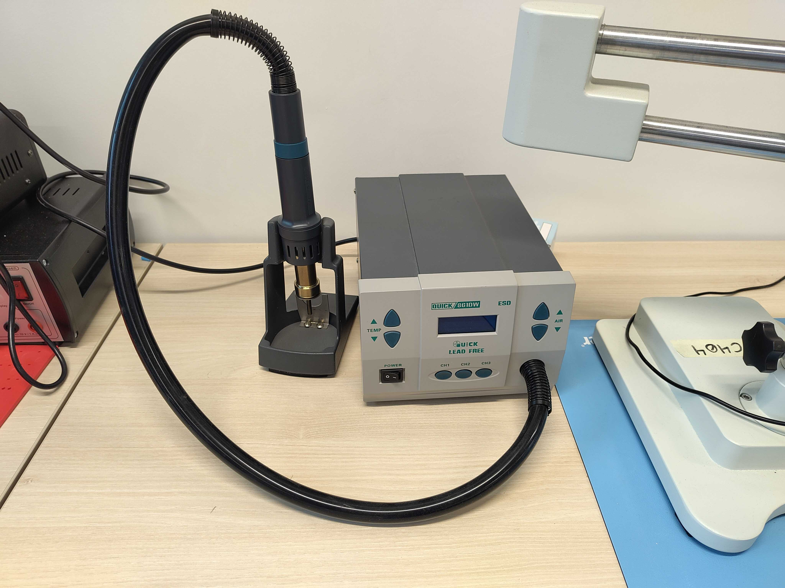

# Soldering Tools

The experimentation room provides the classic soldering station along with
multiple tools, like helping hands.

## Soldering station

### Usage

- Before using the soldering station, turn on the fume extractor using the
  remote control
- Turn on the soldering station

!!! Note

    Don't hesitate to use the [soldering microscope](#soldering-microscope)
    while soldering small components.

!!! warning

    **Don't forget to shutdown the soldering station once you are done with it!**

## Soldering microscope

The soldering microscope is very useful in multiple cases:
- soldering small components using the [soldering station](#soldering-station)
- desoldering small components using the [heat gun](#heat-gun)
- inspecting a PCB after printing paste on it, pick and place, and reflow soldering in the [oven](./pcb.md#oven)

## Heat gun

The heat gun can be used to desolder some components on a PCB.

