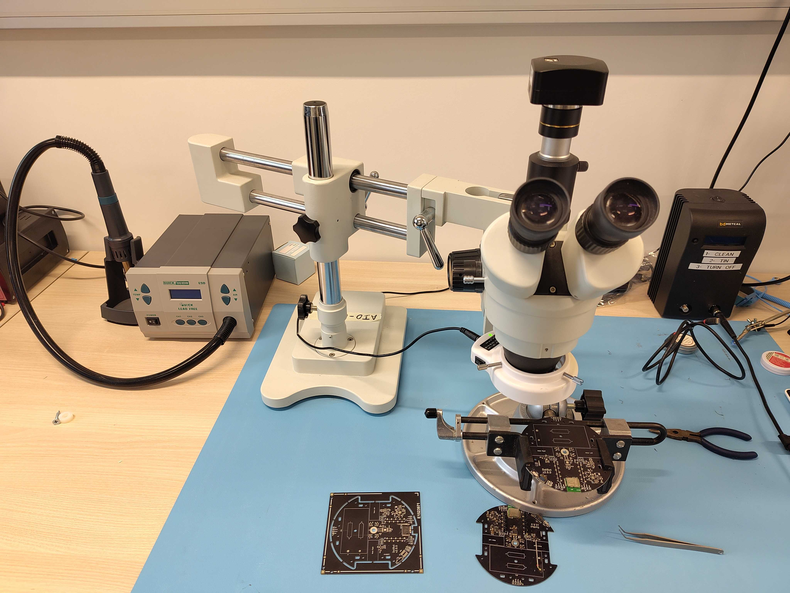

# Other Tools

This page describes other tools available that can be used for
different kind of prototyping: PCB prototyping/fix, mechanical assembly, etc

## Binocular magnifier

The binocular magnifier is very useful in multiple cases:
- soldering small components using the [soldering station](./soldering.md#soldering-station)
- desoldering small components using the [heat gun](./soldering.md#heat-gun)
- inspecting a PCB after printing paste on it, pick and place, and reflow soldering in the [oven](./pcb.md#oven)

## Multimeters

The essential tool in electronics.

## Glue gun

## Self-healing cutting mat

## Lightbox

This tool is used to take nice picture or videos of an object. The background
is neutral and be removed using an image processing tool.
The rotating support can be used to present an object in all angles in a video.

